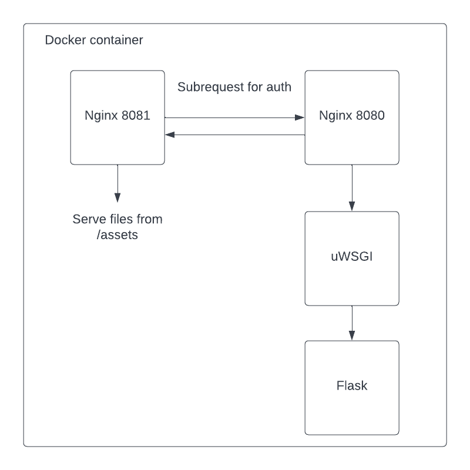

# Assets service
Authentication and authorization for the file-assets service

First you need to copy some data from DEV to your local and then create symlinks.

1. Replace the following line with your IP in `nginx/local/assets.conf`

    - proxy_pass http://130.49.179.105:8080/auth;
2. Replace the following line with your path to the files in `docker-compose.local.yml`
    - "~/codcc/dev-test/data-dev:/Users/SLS325/codcc/dev-test/data-dev"
3. Run
```
./docker-development up local
```
